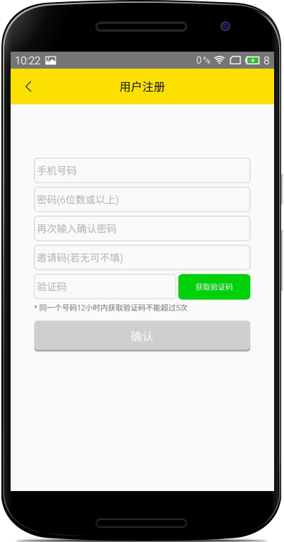
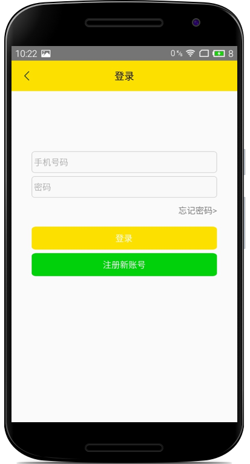
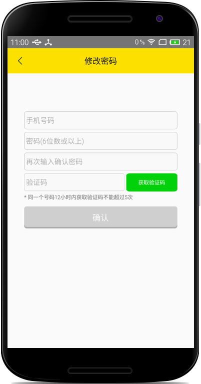

## 注册与登陆

### 1. 注册

操作步骤

1. 填写注册手机号码，密码，确认密码，邀请码(选填)
2. 点击`获取验证码`,获取手机验证码，并正确填写
3. 点击`确认`即可完成注册

### 2. 登陆

操作步骤

1. 按要求输入绑定的手机号码和密码
2. 点击`登陆`即可登陆

### 3. 忘记密码

操作步骤

1. 在**登录页**点击`忘记密码`跳转至修改密码页
2. 按要求填入绑定的手机号码，新密码，确认新密码
3. 点击`获取验证码`，并填写
4. 点击`确认`即可完成修改密码

 
